## Scaling a System from monolithic to microservices

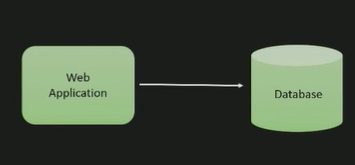

Two  

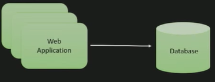

Three

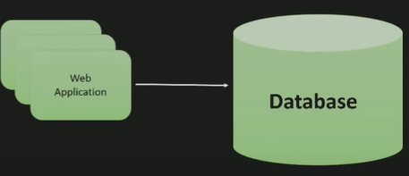

Four

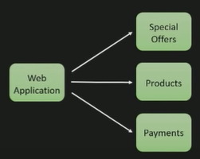

Five

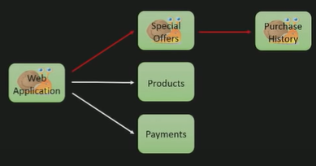

Seven

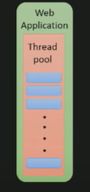

Eight

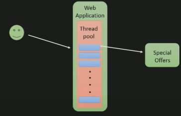

Nine

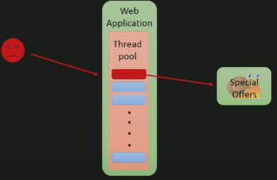

Ten

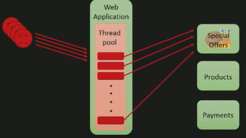

Eleven

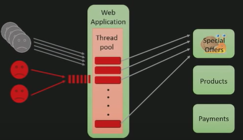

Twelve 

thirteen

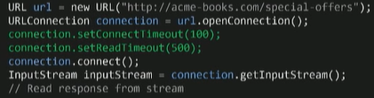

fourteen

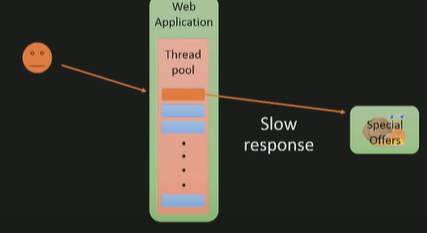

fiveteen

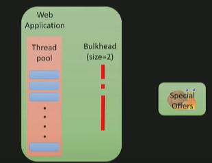

Sixteen

Seventeen

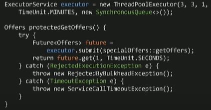

Eighteen

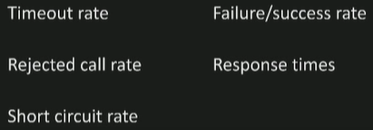