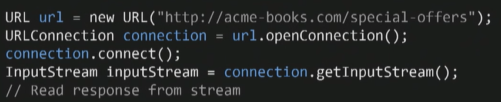
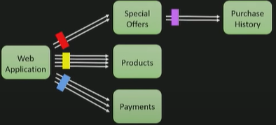

## Scaling a System from monolithic to microservices

### Initial Design

To understand  I will use a  example with a fiction example , acne books is an online book store that sells books at acne we started small with web application connect to database standards set up  and that at th beginning worked great.

### Initials problems

When we had a few users the user base kept growing we got more and more customers and occasionally we ran into some performance problems in the web application we solved this by adding more instances of the web application to increase the availability and solving the issues that way this worked great for a while. 

### Vertical Scaling

We got some more performance issues web applications stopped responding and this was caused by slowness in the database we didn't really find this strange the database was used on every page it was used for everything so obviously if the database was slow the web application would be slow as well we solve this by buying a larger database from a very expensive database vendor.

### Migrating to microservices

Business was good and books sells were really high so we could scale the database one or two more times after that we discover that web problems about developing this application was by the monolithic approch so after some analysis and maybe some hype,  we switched to microservices to be able to scale each individual service and to be able to scale development over several services as well.

We developed  something like this this is a small part of the system we had our web application which our customers used to browse and buy books connected to some services :

* A service for displaying a page with special offers. 
* A service for listing the products that we sell.
* A service for making payments this service is run on separate machines made over the wire calls between them and each service had its own storage to to allow to scale storage separately.

### Problems appear again

This worked great but one day the web application was not responding customers, they couldn't buy any  books we restarted the web application it helped for maybe a minute but then it became non-responsive again , well the web application looks healthy enough but we notice that the special offer service has stopped responding as  well okay that's no big deal the special offers are in a separate page then just nice to have functionality but if the special offer service is not responding and it  shouldn't cause the total web app point of failure.

Okay we continue digging the special offer service is calling a third service a purchase history service to show special offers tuned to the customer's purchase history and this service has stopped responding as well we had encounter a cascading failure where the failure in this purchase history service had cascaded back to the web application a failure in one part of the system have affected other parts more critical parts if our system so if we compare this to the database case with a database failure affected the web application this is so much worse, because this service is not-critical and it´s stopping the entire system.

### Debugging to find the error

What happened when the purchase history survey stopped responding and affected all the rest of the system we sorted look at the web application because that is the component we want to save we're on a standard web container for the web application contains a **thread pool** with a fixed number of threads the **blue boxes** on this imagery illustrates the threads and when the user wants to use a page a request comes in it is assigned one of the threads from the thread pool.

The thread in turn calls the special offer service we want to view that page makes a synchronous call and wasteful response.

 When all is ok the service returns the user gets its response rate but when the service is not responding then the thread will wait for reply and while waiting for the reply it will be blocked it can't handle any other requests.

While waiting for the reply it will be blocked it can't handle any other requests okay so for no big deal where one blocked thread the other threads can still be used for other stuff our users can still browse products and make payments so they don't notice anything yet but as more and more requests to the special offers page come in more and more threads will be blocked until eventually all threads will be blocked.

When all the threads are blocked when additional threads come in they are in queued and this is a really bad situation because even if our service would be would recover and the threads would be unblocked we still have to handle all the queued requests so we really want to avoid in queueing requests okay now we understand what's happening on quite a low level in our application but the question is why.

The code that calls the services looks something like this in this case we create the URL to the special offer service we create a URL connection we open that connection connect it get an input stream and read the response from that stream , but what **why** doesn't this return, well we realize that connect and read time outs in Java they are typically infinite this will block for an infinite amount of time. 

### Stability pattern

If the service never responds this made us realize the first stability pattern use timeouts, timeouts prevents blocked threads we first are timed out of course I timed out our threads can do other stuff in this particular case we could set the connect timeout.

Great we introduced timeout at Acme books, timeout for all the service calls things work great for a couple of months perhaps some services that became slow and didn't respond but the timeouts saved the rest of the system but one day we had to fire again, customers complaining going to buy books had terrible response times, now web application we're awful throughput okay what's up now have what we solve these kind of errors where the web application would be slow let's investigate what's happening.

Thee timeouts seem to be  working well but we notice that the service is called a lot more often that then it usually is, there are a lot of timeouts in fact there are so many timeouts, that it seems that our threads spend most of the time waiting for these timeouts they don't do much other work at all  so our throughput will  go down , we get a throughput that is lower than the number of incoming requests so say that we have a throughput that  can handle 30 requests per second we have 40 requests per second in coming to the to the web application we can keep up with the load and this will cause requests to being queued .

### Bulkheads

The pattern isolates components from each others to prevent Falls in one component to affect others,  then prevent cascading failures an example of a bulkhead would be to limit the memory usage the allowed memory usage of a process so if it would show a memory leak then it would be allowed to just use up a certain limit and would not eat up all the memory on the machine. 

Limit the number of concurrent calls to a service limit the number of calls from one service to another this will put an upper bound on the number of waiting threads so I will talk about this a bit here if we if we have the web application and the special offer service we can add the bulkhead of size say 2 in front of this service between web application and the special offer service but only this we are saying we will allow at most two requests concurrently from the web application.

We have a bulkhead or two of size two to the special offers service a bulkhead of size four to the product service and about eight of size three to the payment service from the web application and this way in this case we have an upper bound of totally nine waiting threads in the web application we'll never have more than nine waiting threads do to slow services and this offers great protection against cascading failures our services can behave basically however they want and we are quite well protected but only if our bulkhead sizes are significantly smaller than they request pool size if you have a bulkhead when calling a service that is of size 40 and we only have 50 request threads in our application then we can still block up most of the threads and get bad performance so meter size our pollock heads small we can reason about bulkhead sizes by looking at the peak load when our system is healthy so let's assume we have 40 requests per second to service and these requests are handled at 0.1 second so this would be a peak load when calling service we have this scenario a suitable bulkhead size would be to multiply these multiply the for two requests per second with the response time of 0.1 seconds and we lead us to a bulking size of four so that would work if we would had a constant load.

Seventeen

When using thread pool handovers if we have a fixed number of threads and we don't NQ requests then we get an included bulkhead if we try to call the service when water they have three outstanding service calls then we will fail immediately with an error so this is great we get generic timeouts and bulkheads with the same construct a straightforward way to implement thread pool handovers is to use a standard java thread pool executors here we neutralize it with three three threads the first two threes or the number of threads and we use a synchronous queue now this is important because if you don't specify the queue to use request will use an unbounded you assume Chris queue will prevent requests from being and queued and we will instead react executions when all the threads are used and when we want to protect our get offers call using this thread pool handover we submit the call to the executor we will get a future in the return wait for this future with our desired timeout in this case one second if we get a rejected execution exception when submitting our job it means that we already have three outstanding calls.

###   

### Monitoring and troubleshooting

We probably need to throw in some monitoring here to be able to get a better understanding of our system but what should we monitor yeah of course obvious stuff like heaps , CPU utilization, but what is specific for a microservices architecture , we discovered that a great place to introduce monitoring is to monitor the service calls we have a lot of services to get a good understanding of them we can monitor how they are called this our integration points these are the places were integrating the system with with itself it's also a good place to detect configuration problems if we protect all our service course with these stability patterns so we need to monitor that we have configured these patterns correctly a crucial thing to measure is the timeout rate the rate at which calls to service or timing out that's a good problem detector and it is also a good place to validate.

The developers over at Netflix has made some awesome stuff for example , hystrix implements these patterns it implements circuit breakers red pool handovers bulkheads it's actually quite great.

Well maybe in 2022 some Netflix libraries are in maintenance mode now, but there are another options such as some pivotal's libraries and another frameworks such as Micronaut.