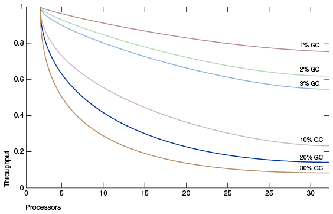

The garbage collector (GC) automatically manages the memory in our Java applications, basically it helps us to avoid to deal with the memory by ourselves.

- The garbage collector is responsible for the following operations:
  - Allocates from and gives back memory to the operating system
  - Hands out that memory to the application as it requests it
  - Determines which parts of the memory is still use by the application
  - Reclaims the unused memory for reuse by the application

- The Java HotSpot garbage collectors employ various techniques to improve the efficiency of these operations:
  - Use generational scavenging in conjuntion with aging to concentrate their efforts on areas in the heap that most likely contain a lot of reclaimable memory areas.
  - Use multiple threads to aggressively make operations on parallel, or performe some long-running operations in the background concurrent application
  - Try to recover larger contiguous free memory by compacting live objects

## Why Does it Matter?

The Java HotSpot VM provides a selection of garbage collection algorithms to choose from. **When it does matter?** The application can perform well in the presence of garbage collection with pauses of modest frequency and duration.
However, specifically for a large class of applications, those with large amounts of data(multiple gigabytes), many thread and high transaction rates it can be the opposite.  

The read line (at top) is an application spending only 1% of the time in a garbage collection on an uniprocessor system. The magenta line shows a 10% of the time in garbage collection.

The main problem may become with large bottlenecks when scaling up to large systems, for example the previous problems with a waste of 10% of the time with a single thread can lead to a 75% of throughput loss when scaling up to 32 processors.